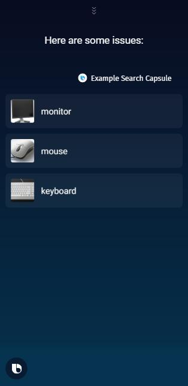
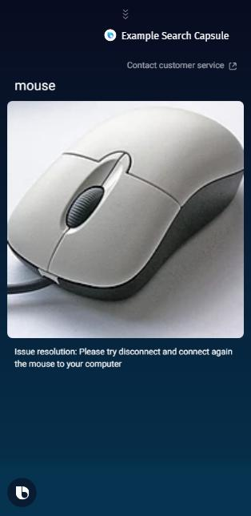

# Customer Service Capsule
Use data file in this folder to generate a Capsule that searches for a resolution to an issue with a computer.

This folder contains a very small set of mock data with potential issues in the form of spreadsheet tables as comma-separated values (csv format).

You can use this template to build capsule that will guide your users or customers how to solve issues with a product or a service. Such capsule can be helpful self-service tool for your Customer Service team.

## Steps to generate Customer Service capsule
1. Use the Bixby Studio wizard to [create a new capsule from template](https://bixbydevelopers.com/dev/docs/sample-capsules/templates).
When prompted to select a template, choose the option to `Import and Search Template` and then choose `English (en)` as a language.

2. Click on "Upload CSV" and select the [./customer_service.csv](./customer_service.csv) file from this repo. Use "Issue" as the concept name and as the label.

3. Click on "Next Step" and provide the Capsule Info. You can use "playground.customer_service" as the namespace and keep the default path.

4. Click "Generate Capsule" and let the Bixby Studio wizard do its magic to materialize a Capsule from the provided information.

5. Open the [Device Simulator](https://bixbydevelopers.com/dev/docs/dev-guide/developers/ide.simulator), select the newly created capsule "playground.customer_service" and compile NL.

6. Ask Bixby to "Show all issues". You should now see all issues from the CSV table listed on the simulator window. Tap on some issue to see details.

## Use cases

### Find all issues
Template adds the following general training by default:

```
[g:Issue] Show all issues
```

You need to review all generated training examples and remove or update them if they do not represent a correct use case in your capsule.
Or, are not a natural way for users to ask for that use case.

You can then compile and try out this training example in Bixby Simulator to see how it works.




### Find resolution for an issue
Now that you have the base of the capsule, you can add training that searches for resolution of specific issue.

Follow those steps to add the new training:
- Open trainings in /resources/en/training ,
- Add "how to fix issue with my mouse" in `Adding New Training` and hit `Add` button,
- Add "Issue" in `GOAL`,
- Click on 'mouse' word and add "IssueName" in `Node` field of the popup window,
- Click `Save`,
- Click on the simulator shortcut icon next to the training to open Simulator.


Or, You can then compile and try out this training example in Bixby Simulator to see how it works.

```
[g:Issue] how to fix issue with my (mouse)[v:IssueName]
```



From now on, your capsule can provide responses to issues with specific part of a computer!


## Fine tune your capsule
What next? Once you generated your Capsule, you will find README.md file in the folder that provide what you may want to do next.
